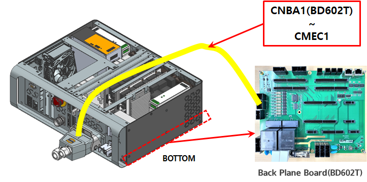
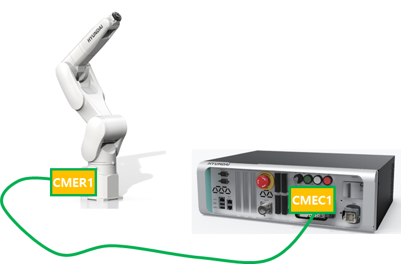

# E51441 (0축) 브레이크 피드백 이상

## 1. 개요

서보 보드(BD640)에서는 브레이크 작동 명령과 브레이크 피드백 회로의 신호를 감시하는 중, 두 신호가 불일치 할 경우 에러를 발생시킵니다. 브레이크 회로의 출력이 정상적으로 이루어지지 않으면 브레이크 작동에 실패할 수 있으므로 서보 보드에서는 이를 감지하여 로봇을 정지시킵니다. 

## 2. 원인 및 점검



(1)	브레이크 배선을 점검하십시오.

(2)	서보보드(BD640)를 점검 하십시오.



(1)	브레이크 배선을 점검하십시오.

브레이크 배선점검 순서는 다음과 같습니다.

1차: 브레이크 배선에 관련된 커넥터들의 접촉 불량여부를 점검하십시오.

2차: 브레이크 배선의 단락 유무를 점검하십시오. 멀티미터(테스터기)와 같은 장비를 이용하여 각 축의 배선을 1:1로 체크하십시오.

3차: 브레이크 배선을 교체시험 하십시오.

브레이크 배선이 단선되지 않고 접촉불량, 브레이크 파워선과 타 전력선 또는 로봇 본체 금속부위와의 접촉 등의 현상이 있을 경우에는 단락유무 검사로는 검사할 수 없으므로 배선 교체시험을 하여 주십시요.

    * 제어기 내부 배선을 점검하십시오.
        Hi6-N 제어기의 경우, CNB1(BD640) 커넥터와 CMC1, CMC2 간의 배선을 점검하십시오.

                    (그림 4.54 N제어기 브레이크 출력 배선)

                    (그림 4.55 T제어기 브레이크 출력 배선)
    
    * 제어기와 로봇간의 배선을 점검하십시오.
        Hi6-N제어기의 경우, CMC1과 CMR1 그리고 CMC2와 CMR2 간의 배선을 Hi6-T15제어기의 경우, CMEC1과 CMER1 간의 배선을 점검하십시오.

                    (그림 4.56 N제어기 브레이크 출력 배선)

                    (그림 4.57 T제어기 브레이크 출력 배선)

(2)	서보보드를 교체 시험하십시오. 

서보 보드를 교체한 후 에러가 발생하지 않으면 서보 보드의 엔코더 데이터 수신부의 고장으로 판단할 수 있습니다.

                    (그림 4.58 N제어기 서보보드 교체)

                    (그림 4.59 T제어기 서보보드 교체)
