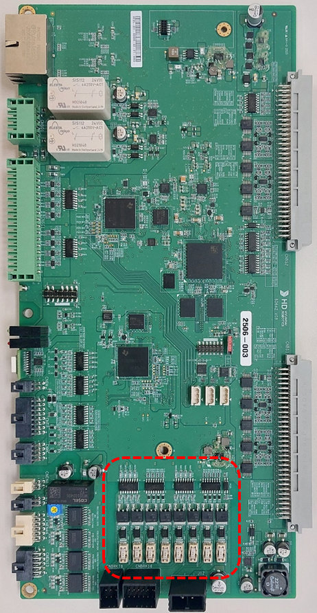

# E51441 (0축) 브레이크 피드백 이상

## 1. 개요

서보안전 보드(BD642)에서는 브레이크 작동 명령과 브레이크 피드백 회로의 신호를 감시하는 중, 두 신호가 불일치 할 경우 에러를 발생시킵니다. 브레이크 회로의 출력이 정상적으로 이루어지지 않으면 브레이크 작동에 실패할 수 있으므로 서보 보드에서는 이를 감지하여 로봇을 정지시킵니다. 

## 2. 원인 및 점검



(1)    브레이크 배선을 점검하십시오. 
(2)    서보안전 보드(BD642)를 점검 하십시오. 



(1)    브레이크 배선을 점검하십시오. 
브레이크 배선점검 순서는 다음과 같습니다. 
1차: 브레이크 배선에 관련된 커넥터들의 접촉 불량여부를 점검하십시오. 
2차: 브레이크 배선의 단락 유무를 점검하십시오. 멀티미터(테스터기)와 같은 장비를 이용하여 각 축의 배선을 1:1로 체크하십시오. 
3차: 브레이크 배선을 교체시험 하십시오. 

브레이크 배선이 단선되지 않고 접촉불량, 브레이크 파워선과 타 전력선 또는 로봇 본체 금속부위와의 접촉 등의 현상이 있을 경우에는 단락유무 검사로는 검사할 수 없으므로 배선 교체시험을 하여 주십시요.

* 제어기 내부 배선을 점검하십시오. 
Hi7-N 제어기의 경우, CNBRK16(BD642) 커넥터와 CMC1, CMC2 간 배선을 점검하십시오.

 
그림 4.25.1 Hi7-N제어기 브레이크 출력 배선

* 제어기와 로봇간의 배선을 점검하십시오. 
Hi7-N제어기의 경우, CMC1과 CMR1 그리고 CMC2와 CMR2 간의 배선을 점검하십시오.

 
그림 4.25.2 N제어기 브레이크 출력 배선

(2)    서보안전 보드를 확인하십시오. 
서보안전 보드를 확인하는 순서는 다음과 같습니다. 
1차: 브레이크 회로에 있는 퓨즈의 단선 유무를 확인하십시오. 
2차: 모든 브레이크 채널의 퓨즈가 이상이 없으면 서보안전 보드를 교체하고 확인하십시오. 

* 브레이크 관련 퓨즈를 점검하십시오. 
서보안전 보드의 경우, 아래 그림 점선 부분에 각 브레이크 별로 퓨즈가 설계되어 있습니다. 테스터기 또는 서보안전 보드의 LED의 점멸 등을 이용하여 점검하십시오. 

 
그림 4.25.3 서보안전 보드 브레이크 퓨즈

* 서보안전 보드를 교체 시험하십시오. 
서보안전 보드를 교체한 후 에러가 발생하지 않으면 서보 보드의 엔코더 데이터 수신부의 고장으로 판단할 수 있습니다.

 
그림 4.25.4 Hi7-N제어기 서보보드 교체

