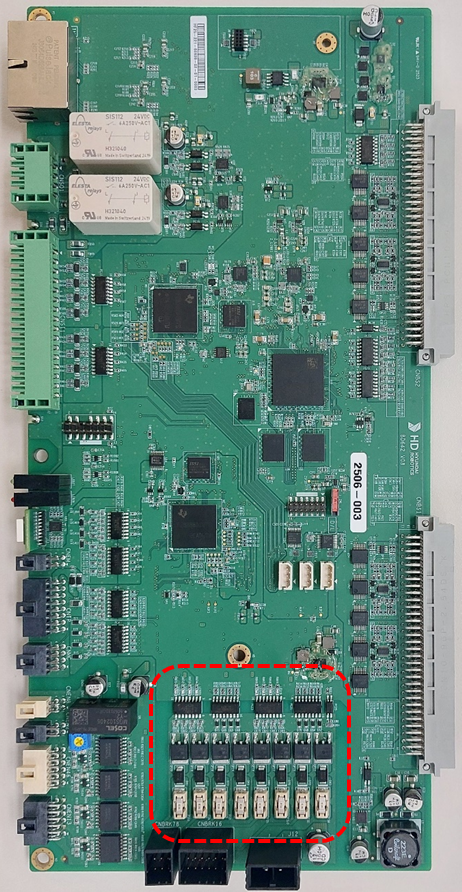

## 4.25. E51441 (0 轴) 刹车反馈错误

### 1. 概述

伺服安全板 (BD642) 监控刹车操作命令及来自刹车反馈电路的信号，如果两个信号不匹配则会产生错误。 
如果刹车电路的输出未正常执行，刹车操作可能会失败，因此伺服板会检测到这一点并停止机器人。

### 2. 原因及检查



(1)    检查刹车接线。 
(2)    检查伺服安全板 (BD642)。 



(1)    检查刹车接线。 
检查刹车接线的顺序如下。 
1st: 检查与刹车接线相关的连接器是否接触不良。 
2nd: 检查刹车接线是否短路。使用万用表（测试仪）1:1 检查每个轴的接线。 
3rd: 进行刹车接线的更换测试。 

如果刹车接线未断开但接触不良，或者刹车电源线与其他电源线或机器人本体的金属部分接触，则无法通过短路测试检测到，因此请进行接线更换测试。

* 检查控制器的内部接线。 
对于 Hi7-N 控制器，检查 CNBRK16 (BD642) 连接器与 CMC1、CMC2 之间的接线。

 
图 4.25.1 Hi7-N 控制器刹车输出接线

* 检查控制器与机器人之间的接线。 
对于 Hi7-N 控制器，检查 CMC1 与 CMR1 之间的接线，以及 CMC2 与 CMR2 之间的接线。

 
图 4.25.2 N 控制器刹车输出接线

(2)    检查伺服安全板。 
检查伺服安全板的顺序如下。 
1st: 检查刹车电路中的保险丝是否熔断。 
2nd: 如果所有刹车通道的保险丝没有问题，更换伺服安全板并检查。 

* 检查与刹车相关的保险丝。 
对于伺服安全板，保险丝为每个刹车设计，位于下图所示的虚线区域内。使用测试仪或通过检查伺服安全板上 LED 的闪烁进行检查。 

 
图 4.25.3 伺服安全板刹车保险丝

* 进行伺服安全板的更换测试。 
如果在更换伺服安全板后没有出现错误，可以确定为伺服板的编码器数据接收部分故障。

 
图 4.25.4 Hi7-N 控制器伺服板更换