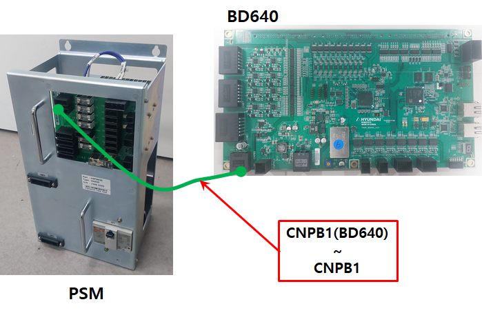
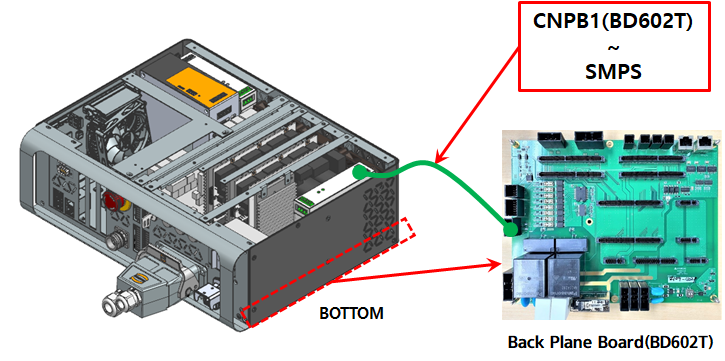

# E51443 브레이크 전원 이상

## 1. 개요

브레이크용 전원(24V)를 서보보드에서 감시하는 중, 설정된 정상 전압 범위를 벗어나는 경우 에러를 발생시킵니다.브레이크 전원이 정상적으로 공급되지 않으면, 로봇 축 고정이 불안정해질 수 있으므로 서보 제어기는 이를 감지하여 에러를 발생시키고 로봇을 안전하게 정지시킵니다.

## 2. 원인 및 점검



(1)	브레이크 전원(24V)가 정상적으로 공급되고 있는지 확인하십시오

(2)	브레이크 전원 케이블의 단선 또는 접촉 불량 상태를 확인하십시오

(3)	서보 보드(BD640)을 교체 하십시오.



(1)	브레이크 전원(24V)가 정상적으로 공급되고 있는지 확인하십시오

브레이크 전원 배선점검 순서는 다음과 같습니다.

1차: 브레이크 전원 배선에 관련된 커넥터들의 접촉 불량여부를 점거하십시오.

2차: 브레이크 전원 배선의 단락 유무를 점검하십시오. 멀티미터(테스터기)와 같은 장비를 이용하여 1:1로 체크하십시오.

    * 파워전장모듈 내부 배선을 점검하십시오.
        Hi6-T15 제어기는 파워전장모듈이 없으므로 해당 사항이 없습니다.

                    (그림 4.44 파워 전장 모듈)

(2)	브레이크 전원 케이블의 단선 또는 접촉 불량 상태를 확인하십시오.

제어기 내부 배선을 점검 하십시오. Hi6-N 제어기의 경우, CNPB1(BD640) 커넥터와 CNPB1(전장보드) 커넥터 간의 배선을 점검하십시오. Hi6-T15제어기의 경우, CNPB1(BD602T) 커넥터와 브레이크 SMPS 출력 간의 배선을 점검하십시오.

                    (그림 4.45 N제어기 브레이크 전원 점검)

                    (그림 4.45 T제어기 브레이크 전원 점검)

(3)	서보보드를 교체 시험하십시오. 

서보 보드를 교체한 후 에러가 발생하지 않으면 서보 보드의 엔코더 데이터 수신부의 고장으로 판단할 수 있습니다.

                    (그림 4.46 N제어기 서보보드 교체)

                 (그림 4.47 T제어기 서보보드 교체)
