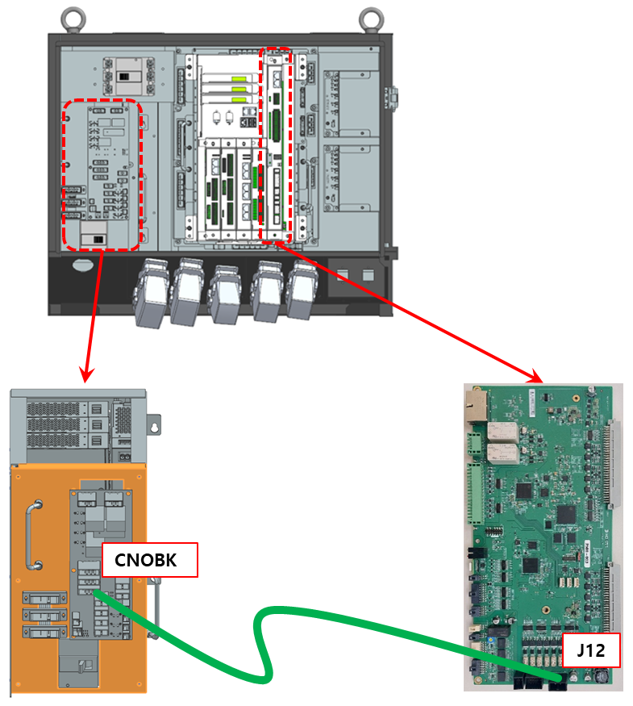

## 4.26. E51443 刹车电源错误

### 1. 概述

当伺服安全板监控刹车电源（24.0V）并且其偏离设定的正常电压范围时，将发生此错误。 
如果刹车电源未正常供应，机器人轴的保持可能变得不稳定，因此伺服控制器检测到这一点，生成错误，并安全停止机器人。

### 2. 原因和检查



(1)    检查刹车电源（24V）是否正常供应。 
(2)    检查刹车电源电缆是否有断开或接触不良。 
(3)    更换伺服安全板（BD642）。 



(1)    检查刹车电源（24V）是否正常供应。 
检查刹车电源接线的顺序如下。 
首次：检查与刹车电源接线相关的连接器是否有接触不良。 
第二次：检查刹车电源接线是否有短路。使用多用表（测试仪）进行1:1检查。 

* 检查电力电气模块的内部接线。 

 
图4.26.1 电力电气模块

(2)    检查刹车电源电缆的断开或接触不良状态。 
检查控制器的内部接线。在Hi7-N控制器的情况下，检查J12（BD642）连接器与CNOBK（电源板）连接器之间的接线。

 
图4.26.2 N控制器刹车电源检查

(3)    执行伺服安全板的更换测试。 
如果在更换伺服安全板后错误不再发生，则可以确定为伺服板的编码器数据接收部分故障。

 
图4.26.3 N控制器伺服板更换