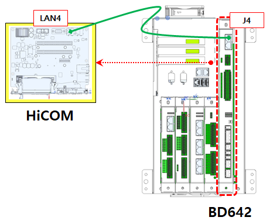

# E29003 전장 보드 통신 오류 (EtherCAT 연결 끊김)

## 1. 개요

전장 보드 통신 오류 (EtherCAT 연결 끊김)가 발생하였습니다. 메인제어모듈(H6COM-T)과 서보안전 보드(BD642)간의 통신이 끊어졌습니다.

## 2. 원인



(1) 보드 간 통신 케이블 결선상태 및 케이블을 확인하십시오. 
(2) 서보안전 보드(BD642)를 점검하십시오. 



### (1)	보드 간 통신 케이블 결선 상태 확인.
### [각 모듈간(메인제어모듈(H6COM-T), 서보안전 보드(BD642)) Ethernet 케이블 결선 상태 확인]

 
그림 5.1.1 Hi7-N제어기 EtherCAT 케이블 연결

1)	점검 대상 
A.	메인제어모듈(H6COM-T) ↔ 서보안전 보드(BD642) 간 Ethernet 케이블 
2)	점검 항목 
A.	케이블 양쪽 커넥터가 확실히 체결되어 있는지 확인합니다. 
B.	케이블에 단선, 압착 손상, 꺾임, 파손이 없는지 육안 점검합니다. 
C.	커넥터 핀(단자)에 녹, 오염, 휘어짐이 없는지 확인합니다. 
3)	점검 방법 
A.	전원을 OFF한 상태에서 케이블 분리 및 재삽입을 수행합니다. 
B.	삽입 시 '딸깍' 소리가 나도록 완전히 체결되도록 합니다. 
C.	필요한 경우 예비 케이블로 교체 후 재시도합니다. 
D.	연결 순서 및 올바른 LAN Port와 연결되어 있는지 재확인합니다. 
4)	추가 확인 
A.	반복적으로 끊김이 발생할 경우, 케이블 내부 단선 가능성 고려 → 케이블 교체가 필요할 수도 있습니다. 
B.	이더넷 커넥터(PCB 단자부) 손상 가능성도 점검하시기 바랍니다. 
C.	서보안전 보드(BD642) 장치 자체에 Link/Act LED 상태를 확인합니다. 
    * 정상: 녹색(좌) 점멸, 황색(우) 점등  
    * 비정상: 녹색(좌) & 황색(우) 꺼짐 또는 점등 상태 유지 
    
 

### (2) 서보안전 보드(BD642)를 점검하십시오.
#### [서보안전 보드(BD642)를 점검하는 방법]
  

1) 전원 상태 확인 
   LED1과 LED2가 초록색으로 점멸하는지 확인하십시오.  
   7-Segment에 P001 혹은 P002로 표기되는지 확인하십시오. 

2) 정상 부팅 상태 확인 
   메인제어모듈 (H6COM-T)이 완전히 부팅되고 난 후(전원투입후 약 50초 정도 소요)  7-Segment에 P002로 표기되어야함. 

1-2) 가 모두 정상임에도 이더캣 통신 연결에 문제가 있는 경우 보드를 교체 하십시오.

 
### (3) 안전보드(BD632)를 점검하십시오.

#### [안전보드(BD632)를 점검하는 방법]
  
 
1)	전원 상태를 확인하는 방법 
A.	위 그림의 두개의 LED가 녹색 점등 상태 인지를 확인 
B.	전원 LED가 적색 또는 소등인 경우 표시된 퓨즈가 정상 상태인지를 확인한다. 
C.	퓨즈가 끊겼다면 퓨즈를 교체한다. 

2)	모터온시 전원이 불안정한 상태인지 확인 
A.	모터온시에 전원 LED가 녹색 점등 상태 인지를 확인한다.  
B.	모터온 순간 적색으로 변하거나 소등되다면 모터온시 전원이 불안정한 상태 임 

3)	전원 상태가 불안정한 경우 
A.	전원 커넥터 체결 상태 확인 
B.	전원 케이블 점검 
C.	안전보드(BD632) 접지 상태 점검 (접지 케이블, 접지 단자 체결 상태) 

4)	안전보드가 정상 부팅 상태인지를 확인 
A.	메인제어모듈 (H6COM-T)이 완전히 부팅되고 난 후(전원투입후 약 50초 정도 소요)  7-Segment의 표시가 ‘S’자로 2개가 표시 되어야 함. 

5)	1)~4)의 점검사항이 모두 이상이 없는 경우에도 통신에 문제가 있다면 안전보드(BD632)를 교체하십시오. 
