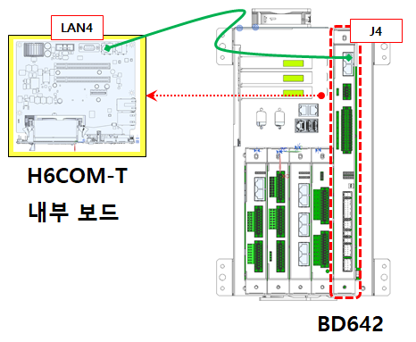
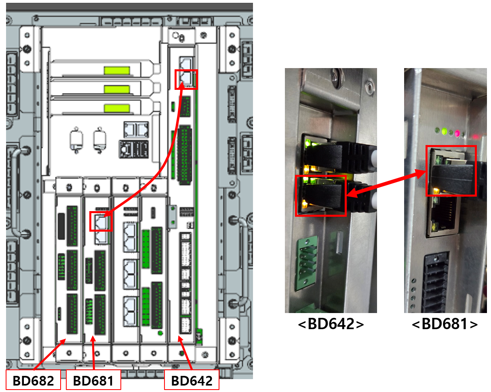
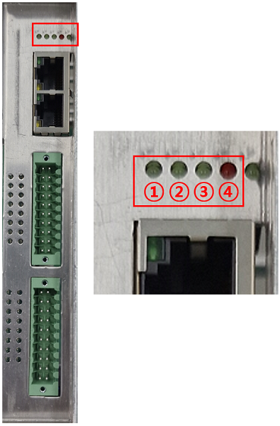

## 5.1. E29003 板通信错误 (EtherCAT 断开)

### 1. 概述

发生了板通信错误 (EtherCAT 断开)。  
主控制模块 (H6COM-T) 与板 (BD642, BD681 等) 之间的通信已断开。

### 2. 原因



(1) 检查板间通信电缆连接及电缆状态。 
(2) 检查板。 

 
板的连接配置因操作环境而异。 
- 单独使用伺服安全板 (BD642) 
- 使用伺服安全板 (BD642) 和用户 DIO 板 (BD681) 



### (1) 检查板间通信电缆连接状态。
### [检查每个模块之间的以太网电缆连接状态 (主控制模块 (H6COM-T) 和板)]

 
图 5.1.1 H6COM-T 和 BD642 之间的 EtherCAT 电缆连接

 

 
图 5.1.2 BD642 和 BD681 之间的 EtherCAT 电缆连接 **(使用 BD681 时)**

1) 检查目标 
A. 主控制模块 (H6COM-T) 与伺服安全板 (BD642) 之间的以太网电缆。 
B. 伺服安全板 (BD642) 与用户 DIO 板 (BD681) 之间的以太网电缆。 **(使用 BD681 时)。** 
2) 检查项目 
A. 检查电缆两端的连接器是否牢固固定。 
B. 目视检查电缆有无断裂、压接损坏、弯曲或损坏。 
C. 检查连接器引脚（端子）是否有腐蚀、污染或弯曲。 
3) 检查方法 
A. 在断电的状态下，断开并重新连接电缆。 
B. 插入时，确保完全插入，直到听到“咔嗒”声。 
C. 如有必要，使用备用电缆更换电缆并重试。 
D. 重新检查连接顺序，确保连接到正确的 LAN 端口。 
4) 其他检查 
A. 如果重复发生断开，请考虑内部电缆断裂的可能性 → 可能需要更换电缆。 
B. 还要检查以太网连接器（PCB 端子区域）是否可能受损。 
C. 检查板上的 Link/Act LED 状态。 
    * 正常: 绿色（左）闪烁，黄色（右）常亮  
    * 异常: 绿色（左）和黄色（右）灯保持熄灭或常亮。 
    
 

### (2) 检查板。
#### [伺服安全板 (BD642) 检查程序]
  
图 5.1.3 BD642 板 LED, 段 

 

  
图 5.1.4 7 段状态信息

 

1) 检查通信连接状态 
   验证 '图 5.1.3' 中的 LED 4 到 5 (绿色) 是否亮起。 

2) 检查正常启动状态 
   在主控制模块 (H6COM-T) 完全启动后 (开机后约 50 秒)， 
   '图 5.1.3' 中的 LED 1 到 5 (绿色) 应该亮起，LED 6 到 10 (红色) 应该熄灭， 
   7 段显示器应显示 '2. 安全状态'，并且小数点闪烁。

如果即使在检查项目 1 和 2 中没有异常，仍然存在通信连接问题，则更换板。 

 
#### [用户 DIO 板 (BD681) 检查程序]
  
图 5.1.5 BD681 板 LED 

 
 
1) 检查通信连接状态 
A. 验证 '图 5.1.5' 中的 LED 3 (绿色) 是否亮起。 

2) 检查正常操作状态 
A. 验证 '图 5.1.5' 中的 LED 1 到 2 (绿色) 是否闪烁。 

如果即使在检查项目 1 和 2 中没有异常，仍然存在通信连接问题，则更换板。 