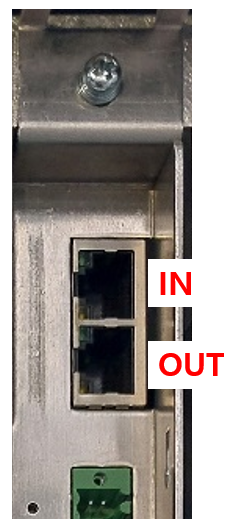
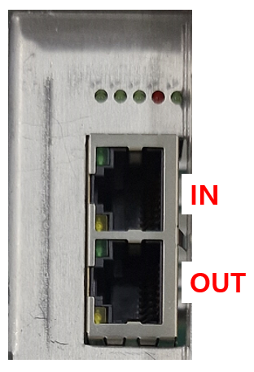

## 5.3. 전장보드 통신(EtherCAT) 마스터 ENI 불일치

### 1. 개요

제어기 통신 연결 구성과 설정된 ENI파일이 불일치 합니다. 
(ENI : EtherCAT Network Information)

### 2. 원인



설정된 ENI파일과 일치하지 않는 제어기 통신 연결 구성입니다. 



### 제어기 통신 연결 구성 확인.

기본적으로 제어기에서 사용할 수 있는 통신 연결 구성이 있습니다. 올바르지 않은 통신 연결로 구성할 경우 정상적으로 사용할 수 없습니다. 
또한 통신 커넥터의 [IN] / [OUT]을 구별하여 연결 해야 합니다. '1번 보드의 [OUT] 커넥터' - '2번 보드의 [IN] 커넥터' 이런 방식으로 올바른 커넥터에 연결해야 정상적으로 통신할 수 있습니다. 

<strong><올바른 통신 연결 구성 예시></strong> 

- 메인제어모듈(H6COM-T) ↔ **[IN]** 서보안전 보드(BD642)
- 메인제어모듈(H6COM-T) ↔ **[IN]** 서보안전 보드(BD642) **[OUT]** ↔ **[IN]** 사용자DIO 보드(BD681)

 

<strong><올바르지 않은 통신 연결 구성 예시></strong> 

- 메인제어모듈(H6COM-T) ↔ **[OUT]** 서보안전 보드(BD642)
- 메인제어모듈(H6COM-T) ↔ **[IN]** 서보안전 보드(BD642) **[OUT]** ↔ **[OUT]** 사용자DIO 보드(BD681)
- 메인제어모듈(H6COM-T) ↔ **[IN]** 사용자DIO 보드(BD681) **[OUT]** ↔ **[IN]** 서보안전 보드(BD642)

 

 
그림 5.3.1 BD642 EtherCAT 통신 커넥터

 

 
그림 5.3.2 BD681 EtherCAT 통신 커넥터

 

올바른 통신 연결을 구성하였을 경우, 제어기 전원을 켜면 ENI파일을 자동으로 선택하여 연결을 시도합니다. 

만약 ENI파일 내부 설정이 맞지 않는 경우, 정상적으로 통신은 연결 되었는데 기능이 정상동작 하지 않을 수 있습니다. 그럴 경우 제어기 메인제어모듈(H6COM-T) 버전업데이트를 진행하거나, 당사에 문의하십시오. 

사용자가 수동으로 ENI파일 선택을 변경하려면 아래의 TP 메뉴에서 설정할 수 있습니다.
변경 후에는 제어기를 재부팅해야 정상적으로 적용됩니다.

**- 메뉴 위치 : [시스템]-[5:초기화]-[10:제어기 설정]**

